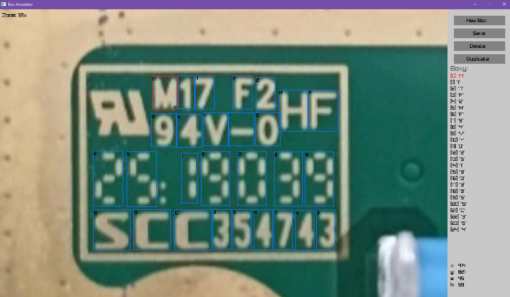

# 🧰 Tesseract Box Labeling Tool

A simple graphical user interface (GUI) written in Go using Raylib, a tool for manually creating `.box` files for a trained Tesseract OCR model.



## ✨ Features

- Drawing rectangles (boxes) over characters in the image.
- Assigning a character (letter/number) to each box.
- Viewing and editing the list of boxes (X/Y position, width, height).
- Support for moving the image with the mouse.
- Ability to scale (zoom) the image.
- Dragging the corners of the box to change its size.
- Duplicating the selected box.
- Saving and loading `.box` files.
- File selection dialog if not provided as an argument.

## 🖥️ Requirements

- Go 1.24.4
- Raylib + binding [github.com/gen2brain/raylib-go](https://github.com/gen2brain/raylib-go)
- Windows / Linux

## 🚀 Run

If you want to run from the terminal:

```bash
go run main.go path/to/image.png
```
